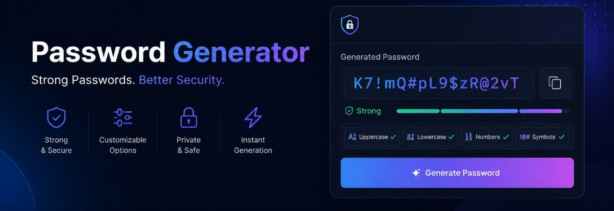

# Password Generator Dashboard 🔐

A modern **Streamlit-based Password Generator Dashboard** built with Python.  
Generate secure, random, and memorable passwords directly from your browser with an interactive UI and password strength checker.

---

## ✨ Features

- Generate secure numeric PIN codes
- Generate customizable random passwords
- Generate memorable word-based passwords
- Password strength meter with visual feedback
- Interactive Streamlit dashboard
- Clean and modular OOP-based architecture
- Beginner-friendly and easy to extend

---

## 📸 Preview



---

## 🛠️ Technologies Used

- Python
- Streamlit
- NLTK
- Object-Oriented Programming (OOP)

---

## 📂 Project Structure

```text
PASSWORD-GENERATOR-DASHBOARD/
│
├── .vscode/
│
├── images/
│   └── banner.jpg
│
├── src/
│   ├── __pycache__/
│   ├── main.py
│   └── password_generators.py
│
├── .gitignore
├── LICENSE
├── README.md
└── requirements.txt
```

---

## 🚀 Installation

### 1. Clone the repository

```bash
git clone https://github.com/mohamadamin-kazemi/password-generator-dashboard.git
```

### 2. Navigate into the project directory

```bash
cd password-generator-dashboard
```

### 3. Install dependencies

```bash
pip install -r requirements.txt
```

### 4. Download NLTK words dataset

Run Python and execute:

```python
import nltk
nltk.download("words")
```

---

## ▶️ Run the Application

```bash
streamlit run src/main.py
```

---

## 🔑 Password Types

### PIN Code Generator
Generate secure numeric PIN codes with customizable length.

### Random Password Generator
Generate strong passwords using:
- Letters
- Numbers
- Symbols

### Memorable Password Generator
Generate readable passwords made from random words with:
- Custom separators
- Optional capitalization

---

## 📊 Password Strength Checker

The application evaluates password strength based on:

- Password length
- Uppercase letters
- Lowercase letters
- Numbers
- Special characters

Strength is displayed visually using:
- Progress bar
- Score indicator
- Security feedback messages

---

## 🧠 Example Usage

```python
from password_generators import RandomPasswordGenerator

generator = RandomPasswordGenerator(
    length=16,
    include_numbers=True,
    include_symbols=True,
)

print(generator.generate())
```

---

## 📦 Requirements

Example dependencies:

```txt
streamlit
nltk
```

---

## 📜 License

This project is licensed under the MIT License.

---

## 👨‍💻 Author

**Mohamadamin Kazemi**

- GitHub: https://github.com/mohamadamin-kazemi

---

## ⭐ Repository

GitHub Repository:

https://github.com/mohamadamin-kazemi/password-generator-dashboard